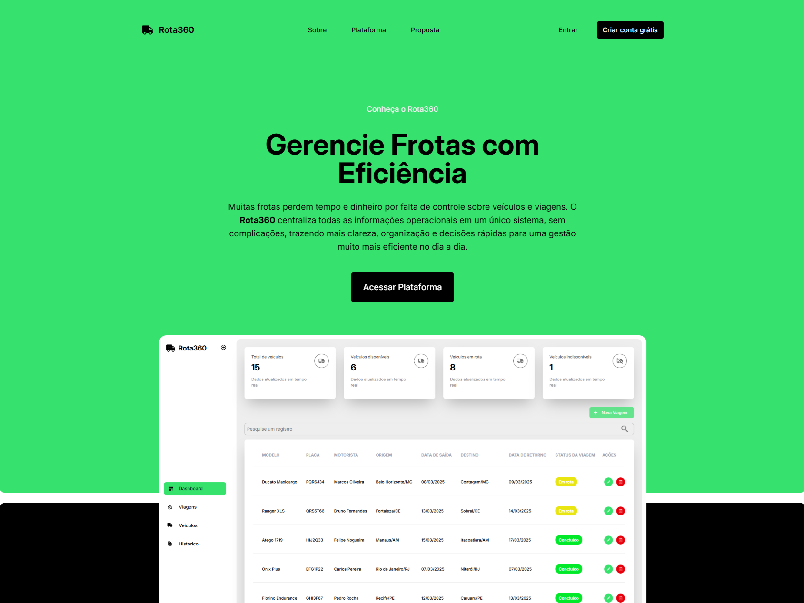
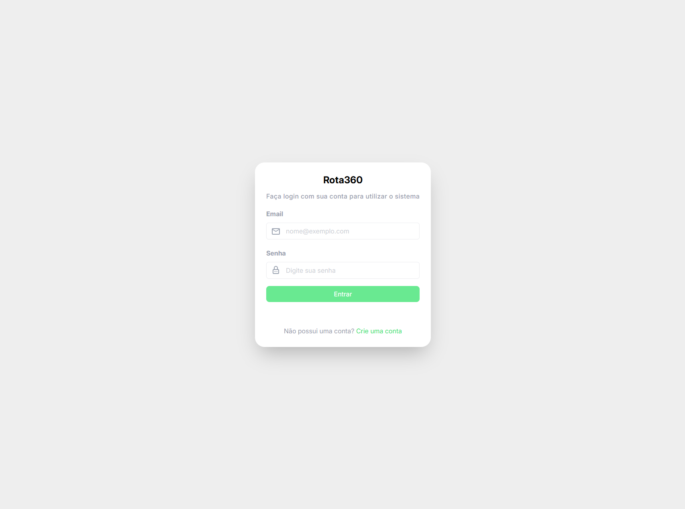
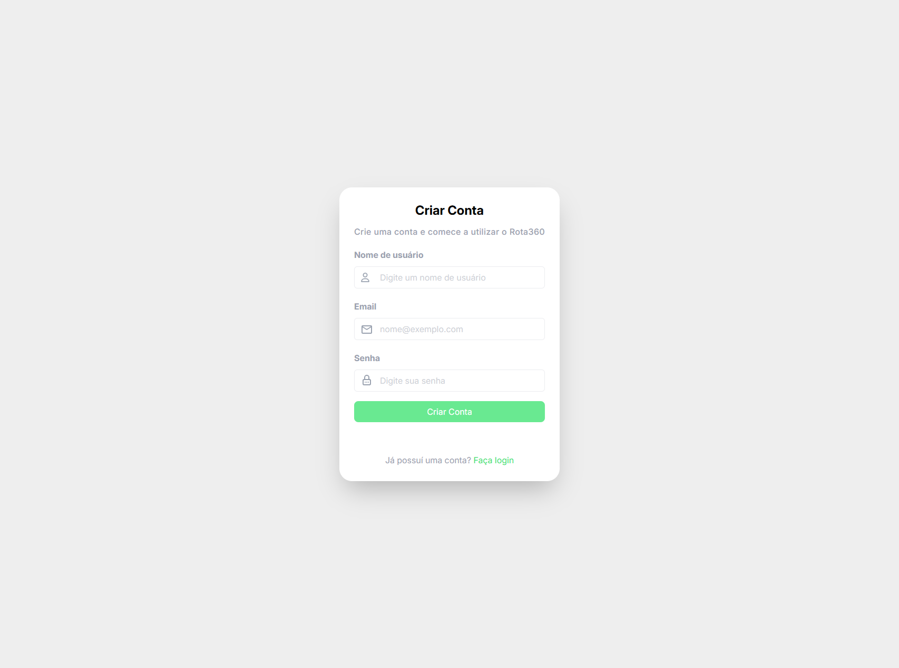
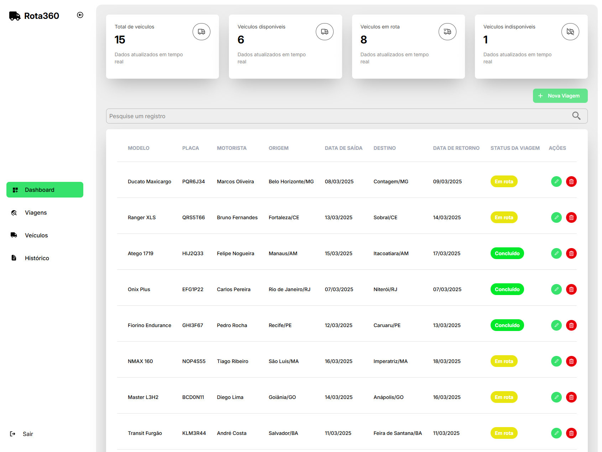
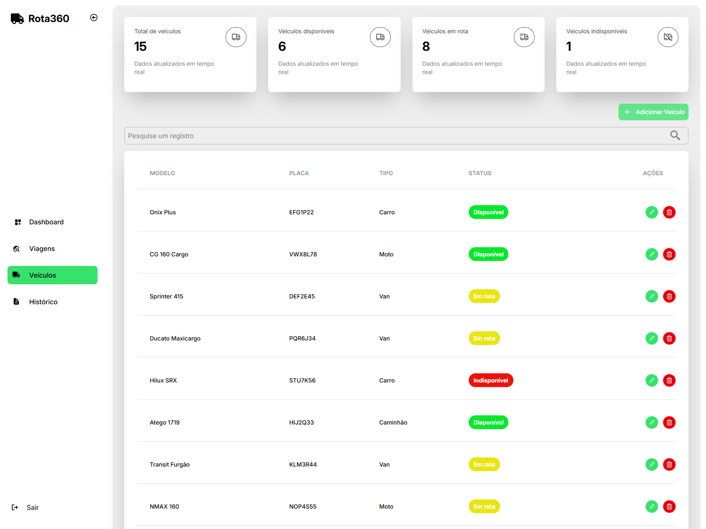
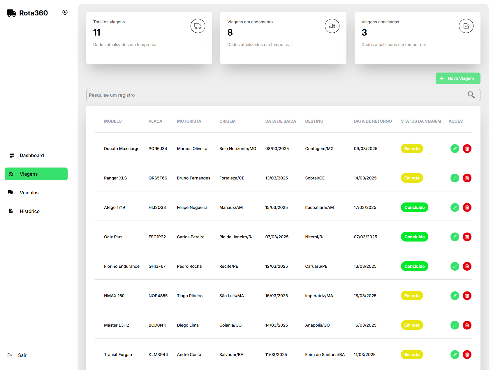
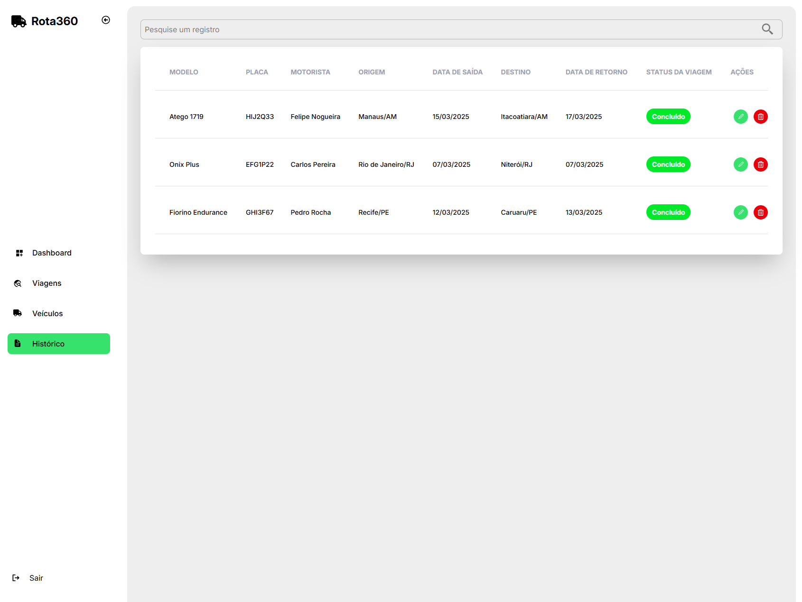

# 🚚 Rota360 – Gestão de Veículos e Viagens


Sistema web para **gestão de frotas e controle de viagens**, permitindo acompanhar veículos, status das viagens, disponibilidade da frota e histórico operacional em **tempo real**, de forma simples, organizada e eficiente.

---

## 🚀 Visão Geral

O **Rota360** foi desenvolvido para atender profissionais de micro e pequenas empresas que precisam de **controle total sobre veículos e deslocamentos**, como empresas de logística, transportadoras, prestadores de serviço e negócios que utilizam frota própria.

A plataforma oferece:

- Cadastro e gerenciamento de **veículos**
- Registro e acompanhamento de **viagens**
- Controle automático de **status da frota**
- Histórico completo de viagens concluídas
- Dashboard com **indicadores em tempo real**

O sistema aplica **regras de negócio consistentes**, garantindo integridade entre veículos e viagens e evitando conflitos operacionais.

---

## 🖼️ Demonstração

### Login


### Signup


### Dashboard


### Veículos


### Viagens


### Histórico


---

## 🧩 Funcionalidades

### 🔐 Autenticação

- Criação de conta
- Login seguro
- Controle de sessão
- Logout disponível

---

### 📊 Dashboard Inteligente

O dashboard apresenta **informações estratégicas em tempo real**, organizadas em cards dinâmicos.

#### 🚘 Veículos
- Total de veículos
- Veículos disponíveis
- Veículos em rota
- Veículos indisponíveis

#### 🧭 Viagens
- Total de viagens
- Viagens em andamento
- Viagens concluídas

---

### 🚘 Gestão de Veículos

- Cadastro de veículos
- Edição de registros
- Exclusão de veículos

#### Campos disponíveis:
- Modelo
- Placa
- Tipo
- Status
- Observações

#### 🔒 Regras de Negócio
- Veículos são cadastrados como **Disponíveis** por padrão
- Veículos **em rota**:
  - ❌ Não podem ser editados
  - ❌ Não podem ser excluídos
- Veículos **disponíveis ou indisponíveis**:
  - ✔️ Podem ser editados
  - ✔️ Podem ser excluídos

---

### 🧭 Gestão de Viagens

- Cadastro de viagens
- Atualização de informações
- Conclusão de viagens
- Exclusão de viagens

#### Campos disponíveis:
- Veículo vinculado
- Motorista
- Origem
- Destino
- Data de saída
- Data de retorno
- Observações

#### 🔄 Regras de Negócio
- Ao iniciar uma viagem:
  - O veículo vinculado passa automaticamente para **Em rota**
- Ao concluir uma viagem:
  - O status da viagem muda para **Concluído**
  - O veículo vinculado volta automaticamente para **Disponível**
- Viagens concluídas:
  - ❌ Não podem ser editadas

---

### 📜 Histórico de Viagens

- Exibição apenas de viagens **concluídas**
- Pesquisa por qualquer campo do registro
- Visualização organizada para auditoria e controle

---

## 🛠️ Tecnologias Utilizadas

Este projeto foi desenvolvido utilizando as seguintes tecnologias:

- **Frontend:** React.js
- **Linguagem:** TypeScript
- **Estilização:** Tailwind CSS
- **Gerenciamento de Estado:** Context API
- **Backend / Serviços:** Firebase
  - Firebase Authentication
  - Firestore Database (Realtime)

---

## 📁 Estrutura do Projeto

```text
rota360-app/
├── src/
│ ├── assets/            # Arquivos estáticos
│ ├── components/        # Componentes reutilizáveis
│ ├── contexts/          # Context API (auth, veículos, viagens, cards)
│ ├── pages/             # Páginas da aplicação
│ │ ├── Admin/
│ │ │   ├── Dashboard
│ │ │   ├── History
│ │ │   ├── Trips
│ │ │   └── Vehicles
│ │ ├── Home
│ │ ├── Login
│ │ ├── Signup
│ │ └── NotFound
│ ├── services/          # Integrações com Firebase
│ ├── App.tsx
│ ├── main.tsx
│ └── index.css
├── .env
├── package.json
├── vite.config.ts
└── README.md

```
---

## ▶️ Como Executar o Projeto

### 📋 Pré-requisitos

- Node.js (versão 18 ou superior)
- NPM ou Yarn

---

### 🔧 Configuração do Ambiente

Este projeto utiliza o **Firebase**, portanto é necessário configurar as variáveis de ambiente.

Crie um arquivo **`.env`** na raiz do projeto e adicione:

```env
VITE_FIREBASE_API_KEY=
VITE_FIREBASE_AUTH_DOMAIN=
VITE_FIREBASE_PROJECT_ID=
VITE_FIREBASE_STORAGE_BUCKET=
VITE_FIREBASE_MESSAGING_SENDER_ID=
VITE_FIREBASE_APP_ID=
```
> ⚠️ As credenciais podem ser obtidas no console do Firebase ao criar um novo projeto.

---

### ▶️ Executando a aplicação

```bash
# Clone o repositório
git clone https://github.com/rogeranacleto/rota360-app.git

# Acesse a pasta do projeto
cd rota360-app

# Instale as dependências
npm install

# Inicie a aplicação
npm run dev
```

---

## 🎯 Objetivo do Projeto

O **Rota360** foi criado para ajudar micro e pequenas empresas a organizarem e controlarem veículos e viagens em um único lugar, centralizando informações essenciais da operação de forma clara e acessível. A plataforma permite acompanhar o status da frota, gerenciar viagens com mais organização, evitar conflitos no uso dos veículos e manter um histórico completo de viagens concluídas, contribuindo para uma operação mais simples, segura e eficiente.